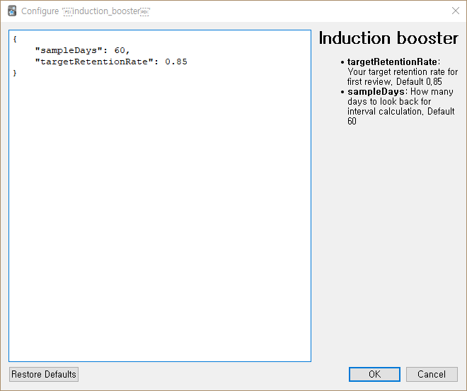

# Induction booster

| Help! this addon needs your help to be complete! Share your review history to help me refine my algorithms. See [reddit post](https://www.reddit.com/r/Anki/comments/fhd8t7/request_your_learning_history/) for more information :) |
| --- |

Boosts your initial card interval! Review fewer times while achieving the desired retention rate.
The most problematic things about Anki is that just-learnt card appears too much on a review cycle.
**Most young cards are easy**, and they don't require that much reviews to be retained.
**This addon tries to identify such easy new cards and give them an interval boost.**

## How it works

- **Induction length**: How many time you need to review the card to memorize it initially. If you know the card and just press 'Easy' on the first sight, induction length is 1. If you didn't know the card on the first time ('Again'), but memorized it afterwards and pressed 'Good'-'Good', the induction length for that card is 3.

This addon categorizes your young cards based on the induction length. Cards with shorter induction length is deemed 'Easy', and they get a longer initial review interval.
Cards that are harder to memorize get a shorter review interval. **Review intervals are calculated to match your desired retention rate**. You can set the retention rate on
addon settings.

## Caveats

- 'Easy interval' settings will be overridden.
- Different deck might require different scheduling, but this addon doesn't account for that.
